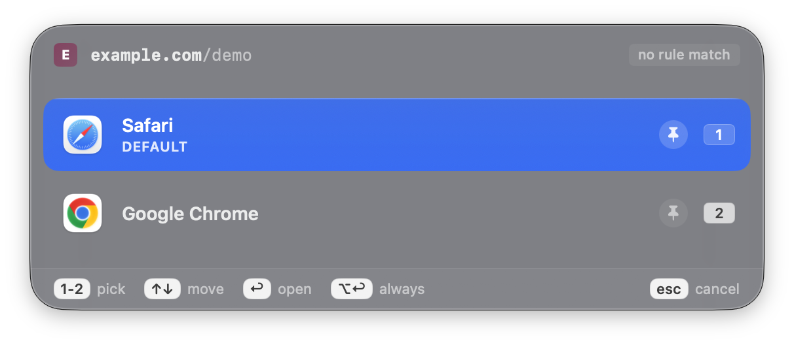
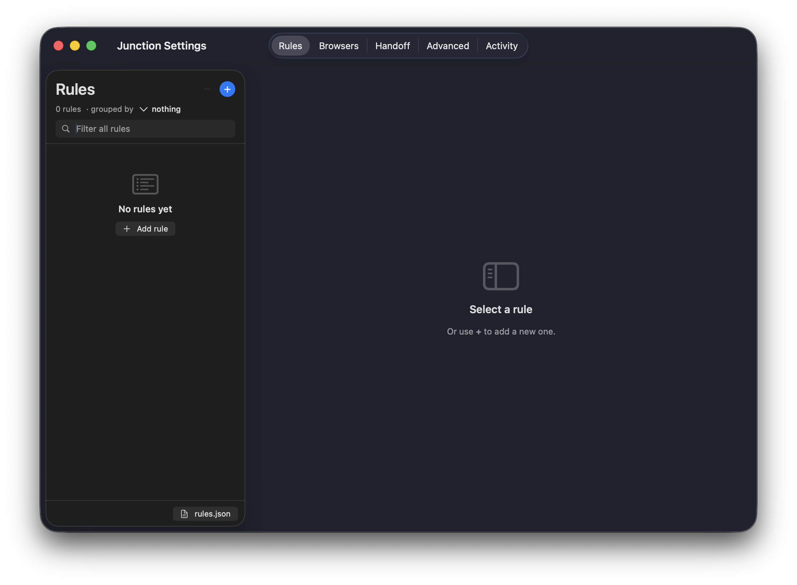
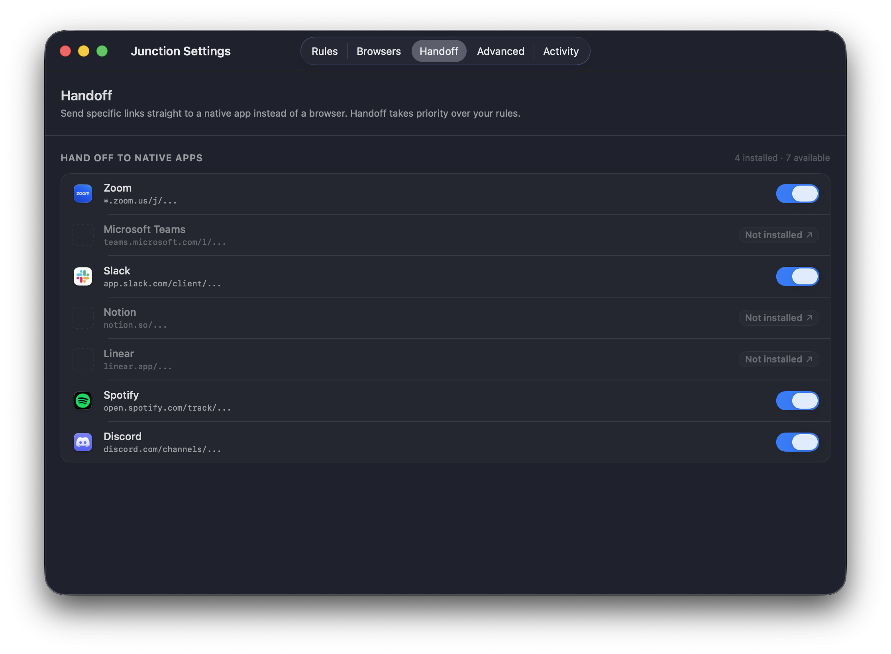

# Junction

**A native, open-source browser router for macOS.** Click a link anywhere —
Junction decides which browser (and which profile) opens it, from rules you
define. No rule? A fast keyboard-driven picker lets you choose.

> **Status:** feature-complete, in dogfooding. Not yet signed/notarized, so
> there's no one-click installer — build from source for now (it's quick).
> A signed Homebrew cask is the last milestone before v0.1.

<!-- Drop captures into docs/screenshots/, then uncomment — see docs/screenshots/CAPTURE.md

-->

---

## What it does

You probably use more than one browser — or more than one Chrome profile
(work vs. personal). macOS only lets you pick **one** default browser, so
every link is a small papercut: wrong browser, wrong profile, drag the URL
across, sign in again.

Junction sits in that gap. It registers as your default browser, then for
every link:

1. **Rules match first.** `*.zoom.us` → Zoom app. `github.com` → work
   Chrome. `news.ycombinator.com` → Safari. Silent, instant.
2. **No match? The picker appears** — a keyboard-driven panel. Pick a
   browser, or pin it to create a rule on the spot.
3. **Native apps win where it matters.** A Zoom link can open the Zoom
   app directly, skipping the browser entirely.

## Why another one of these?

The browser-router niche exists, but every option has a catch in 2026:

| App | The catch |
| --- | --- |
| [Browserosaurus](https://github.com/will-stone/browserosaurus) | Discontinued. Picker only, no rules. |
| [Velja](https://sindresorhus.com/velja) | Closed-source, paid. |
| [Finicky](https://github.com/johnste/finicky) | Open-source, but JS-config only — no GUI, no picker. |
| [Choosy](https://www.choosyosx.com/) | Closed-source, paid. |
| [Browserino](https://github.com/AlexStrNik/Browserino) | Open-source and native — closest sibling. No URL rewriting, no app-origin rules, no native-app handoff yet (see issues [#13](https://github.com/AlexStrNik/Browserino/issues/13), [#42](https://github.com/AlexStrNik/Browserino/issues/42), [#49](https://github.com/AlexStrNik/Browserino/issues/49)). |

**Junction** is the combination that didn't exist: open source (MIT),
native (Swift/SwiftUI — no Electron, ~10 MB), with **both** a rules engine
*and* a picker, plus a real settings UI.

A handful of recurring Browserino feature requests are first-class in
Junction by design — app-origin rules
([#13](https://github.com/AlexStrNik/Browserino/issues/13)), native-app
handoff for Zoom/Slack/etc.
([#42](https://github.com/AlexStrNik/Browserino/issues/42)), URL
rewriting ([#49](https://github.com/AlexStrNik/Browserino/issues/49)),
hiding non-browser apps that register as `http` handlers
([#36](https://github.com/AlexStrNik/Browserino/issues/36)), and promoting
unrecognized browsers the allowlist missed
([#24](https://github.com/AlexStrNik/Browserino/issues/24)). If you found
your way here from one of those threads, that's why.

## Features

- **Rule engine** — match on host (+ subdomains), host regex, or URL
  substring; route to any browser + profile + launch args.
- **Keyboard-driven picker** — for unmatched URLs. Number keys, arrows,
  Return. Pin a row to turn the choice into a saved rule.
- **Per-browser profiles** — Chrome/Brave/Edge/Vivaldi/Opera
  (`--profile-directory`) and Firefox (`-P`). Real profile names are
  detected and shown in the rule editor — no guessing `Default` vs
  `Profile 1`.
- **Native-app handoff** — Zoom, Teams, Slack, Notion, Linear, Spotify,
  Discord. A matching URL opens the native app instead of a browser.
- **URL rewriting** — strips `utm_*`, `fbclid`, `gclid`, and other
  tracking params before routing. Pure, local, no network.
- **Visual rule editor** — a two-pane Settings tab: grouped rule list +
  inline editor with a host-chip matcher and a live "test this URL" field.
- **Live config reload** — `rules.json` is plain text; edit it in any
  editor and Junction picks it up instantly (it watches the file).
- **Liquid Glass picker** on macOS 26, graceful material fallback below.

## Screenshots

_Coming — see [`docs/screenshots/CAPTURE.md`](docs/screenshots/CAPTURE.md)
for the shot list._

<!-- Uncomment as docs/screenshots/ is populated:
### The picker


### Rules — two-pane editor


### Native-app handoff

-->

## Install

No signed build yet — build from source. It takes about a minute.

**Requirements**

- macOS 14 Sonoma or newer
- Xcode 16 or newer
- [XcodeGen](https://github.com/yonaskolb/XcodeGen) — `brew install xcodegen`

**Build & run**

```bash
git clone https://github.com/pkajaba/junction.git
cd junction
xcodegen generate          # writes Junction.xcodeproj from project.yml
open Junction.xcodeproj
# ⌘R in Xcode
```

`Junction.xcodeproj` is generated from `project.yml` and is **not**
committed — that sidesteps the merge-conflict pain of binary Xcode
projects. Re-run `xcodegen generate` after pulling changes to `project.yml`.

**Set it as your default browser**

System Settings → Desktop & Dock → Default web browser → Junction. (An
unsigned build may not appear in that dropdown; `design/set_default_browser.swift`
is a small helper that sets it via the same API the dropdown uses.)

## How it works

### Rules

Rules live in `~/Library/Application Support/Junction/rules.json` — plain
JSON, hand-editable, git-friendly. Junction watches the file and reloads on
save. Or use **Settings → Rules** (`⌘,`): a grouped list on the left, an
inline editor on the right with a visual host-chip matcher and a live URL
tester.

```json
{
  "schemaVersion": 1,
  "rules": [
    {
      "name": "GitHub → work Chrome",
      "enabled": true,
      "match": { "type": "host", "value": "github.com" },
      "target": {
        "browserBundleID": "com.google.Chrome",
        "profile": "Default"
      }
    }
  ]
}
```

**Matchers:** `host` (exact or subdomain — `github.com` matches
`api.github.com` but not `notgithub.com`), `hostRegex` (case-insensitive
regex on the host), `urlContains` (case-insensitive substring on the whole
URL). Rules evaluate top to bottom; first enabled match wins.

### The picker

When no rule matches, the picker appears — centered, keyboard-first:

- `1`–`9` — open in that browser
- `↑` `↓` — move selection · `↩` — open · `esc` — cancel
- `⌥↩`, or click a row's **pin** — open *and* save a rule for that host

### URL rewriting

Tracking parameters (`utm_*`, `fbclid`, `gclid`, `msclkid`, …) are stripped
before matching and opening, so the browser gets a clean URL. Configurable
in **Settings → Advanced**. Pure value transform — no network, no logging.

### Native-app handoff

If you have the native app, a matching link can open it directly:

| Link | Opens in |
| --- | --- |
| `*.zoom.us/j/…` | Zoom |
| `teams.microsoft.com/l/…` | Microsoft Teams |
| `app.slack.com/client/…` | Slack |
| `notion.so/…` | Notion |
| `linear.app/…` | Linear |
| `open.spotify.com/…` | Spotify |
| `discord.com/channels/…` | Discord |

Each is opt-in per app in **Settings → Advanced** (only enabled when the
app is installed). Handoff takes priority over rules.

### Profiles

| Browser family | How |
| --- | --- |
| Chromium (Chrome, Brave, Edge, Vivaldi, Opera, all channels) | `--profile-directory=<dir>` — profile names read from the browser's `Local State` |
| Firefox (incl. Developer Edition, Nightly) | `-P <name>` — read from `profiles.ini` |
| Safari / Arc | Not supported — Apple/Arc expose no external profile API ([#13](https://github.com/pkajaba/junction/issues/13)) |

## Status & roadmap

| | |
| --- | --- |
| Core (URL routing, rules, picker, profiles, rewriter) | ✅ Done |
| Settings UI, native-app handoff, redesigned picker | ✅ Done |
| Unit tests, SwiftLint, CodeQL, CI | ✅ Done |
| **Sign + notarize + Homebrew cask → v0.1** | ⏳ Last step (needs an Apple Developer ID) |

See [SPEC.md](./SPEC.md) for the architecture and [CLAUDE.md](./CLAUDE.md)
for a contributor's orientation to the codebase.

## Contributing

Issues and PRs welcome. The codebase is small, dependency-free, and
documented in [CLAUDE.md](./CLAUDE.md). See
[CONTRIBUTING.md](./CONTRIBUTING.md) and the issue templates. Tests run on
every PR via GitHub Actions; `swiftlint` runs on every build.

## License

[MIT](./LICENSE) — same as Browserosaurus and Finicky. Fork freely.

## Acknowledgements

Junction stands on the shoulders of
[Browserosaurus](https://github.com/will-stone/browserosaurus) (Will
Stone) and [Finicky](https://github.com/johnste/finicky) (Johannes
Stenmark) — both proved this kind of tool can be loved.
[Browserino](https://github.com/AlexStrNik/Browserino) (Alex Strnik) is
the nearest contemporary MIT-licensed native option; reading through its
issue tracker shaped several of Junction's defaults. Junction's goal is
to keep that experience alive, natively and openly.
